# Лабораторна робота 1. Робота з СУБД PostgreSQL та основи SQL

## Загальна інформація

**Здобувач освіти:** Панасюк Владислав Васильович
**Група:** ІПЗ-32
**Обраний рівень складності:** 3 (Високий рівень)

## Виконання завдань

### Список таблиць

```sql
-- Запит для отримання списку таблиць
SELECT table_name
FROM information_schema.tables
WHERE table_schema = 'public'
ORDER BY table_name;
```

Результат: У базі даних створено 8 основних таблиць: categories, customers, employees, order_items, orders, products, regions, suppliers.

---

### Рівень 1

### 1.1.1. Отримати всі записи з таблиці customers

```sql
SELECT
    *
FROM customers AS c;
```

Результат: Отримано 15 записів клієнтів, включаючи фізичних та юридичних осіб з різних міст України. Повний огляд клієнтської бази для CRM-системи та верифікації контактів.

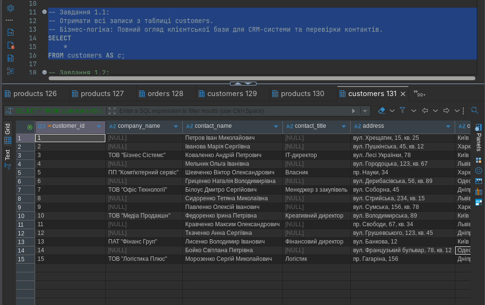

### 1.1.2. Вивести тільки назви товарів і їхні ціни з таблиці products

```sql
SELECT
    p.product_name,
    p.unit_price
FROM products AS p;
```

Результат: Отримано 25 найменувань техніки з актуальними цінами. Формування базового прайс-листа для сайту без зайвих технічних полів.

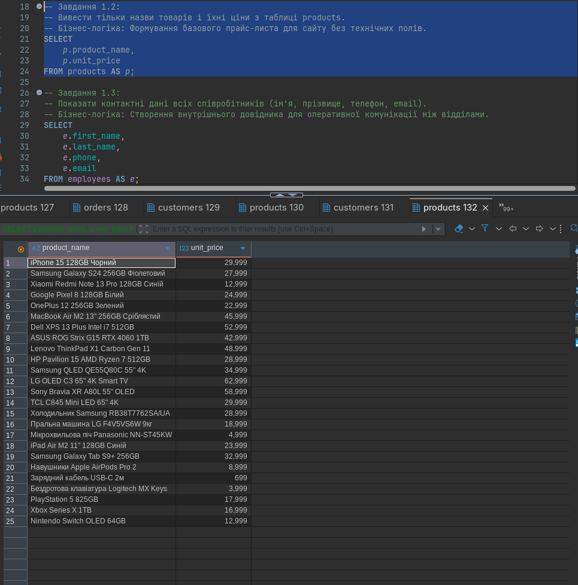

### 1.1.3. Показати контактні дані всіх співробітників

```sql
SELECT
    e.first_name,
    e.last_name,
    e.phone,
    e.email
FROM employees AS e;
```

Результат: Отримано контактні дані 8 співробітників компанії. Створення внутрішнього довідника для оперативної комунікації між відділами.

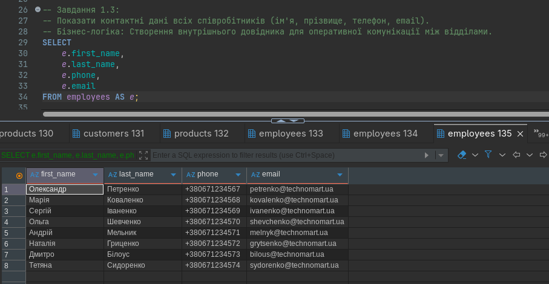

### 1.2.1. Знайти всіх клієнтів з міста Київ

```sql
SELECT
    *
FROM customers AS c
WHERE c.city = 'Київ';
```

Результат: Відібрано 4 клієнти зі столиці. Таргетинг промо-кампанії експрес-доставки для мешканців Києва.

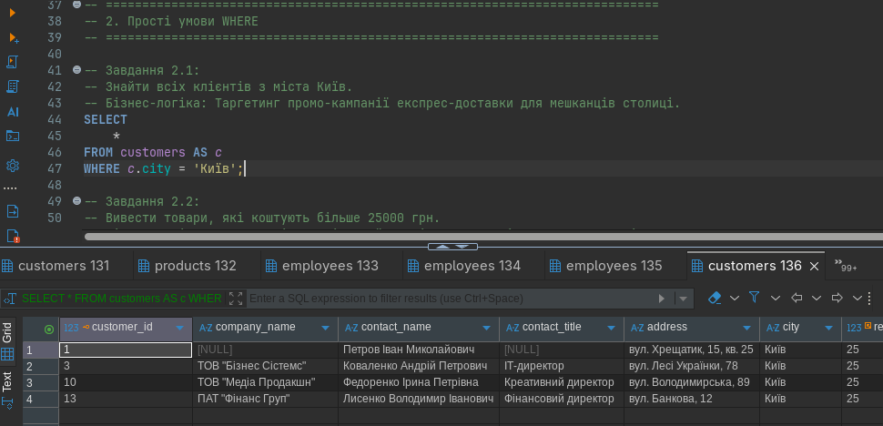

### 1.2.2. Вивести товари, які коштують більше 25000 грн

```sql
SELECT
    p.product_name,
    p.unit_price
FROM products AS p
WHERE p.unit_price > 25000;
```

Результат: Отримано 8 позицій флагманських смартфонів, ноутбуків та телевізорів. Сегментація преміальної техніки для оцінки маржинальності.

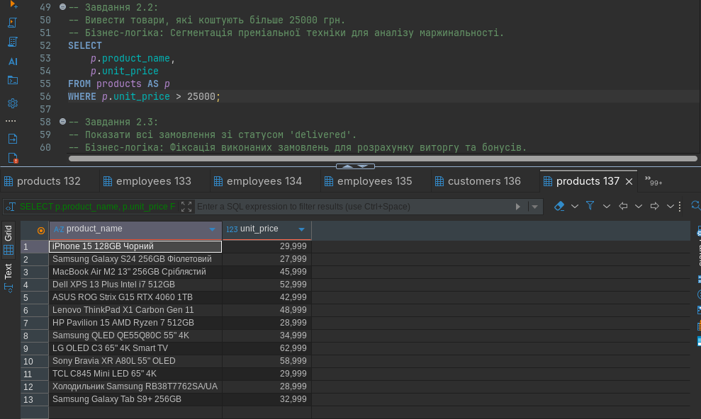

### 1.2.3. Показати всі замовлення зі статусом 'delivered'

```sql
SELECT
    *
FROM orders AS o
WHERE o.order_status = 'delivered';
```

Результат: Відібрано 22 успішно виконані доставки. Фіксація завершених замовлень для розрахунку товарообігу та бонусів менеджерам.

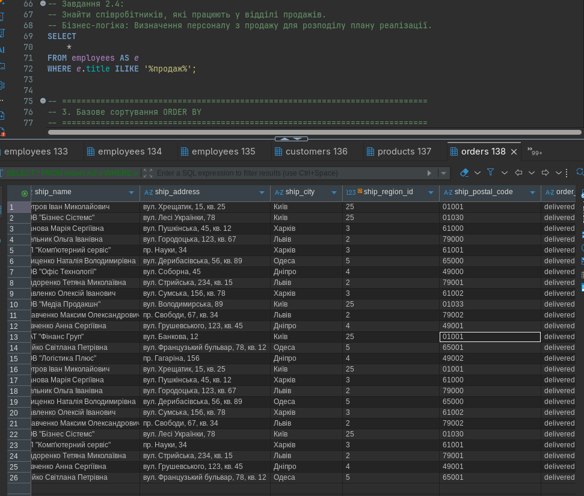

### 1.2.4. Знайти співробітників, які працюють у відділі продажів

```sql
SELECT
    *
FROM employees AS e
WHERE e.title ILIKE '%продаж%';
```

Результат: Знайдено 3 штатних менеджерів з продажу. Визначення персоналу збуту для розподілу планів реалізації.

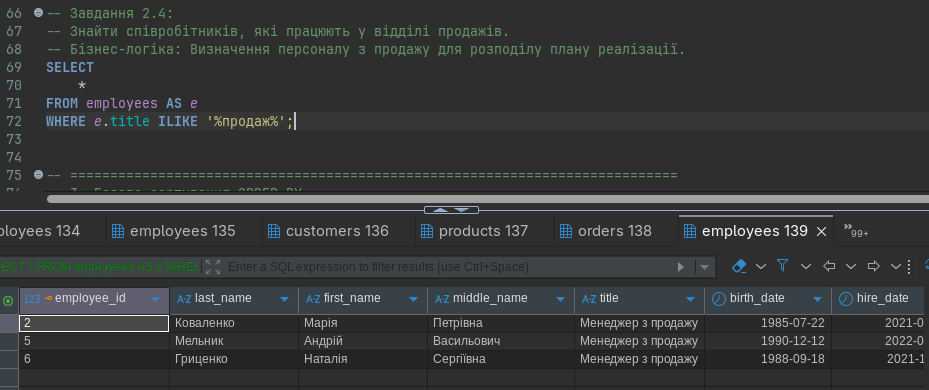

### 1.3.1. Відсортувати товари за зростанням ціни

```sql
SELECT
    *
FROM products AS p
ORDER BY p.unit_price;
```

Результат: 25 товарів впорядковано за зростанням вартості від 699 до 62 999 грн. Налаштування сортування каталогу від дешевих до дорогих.

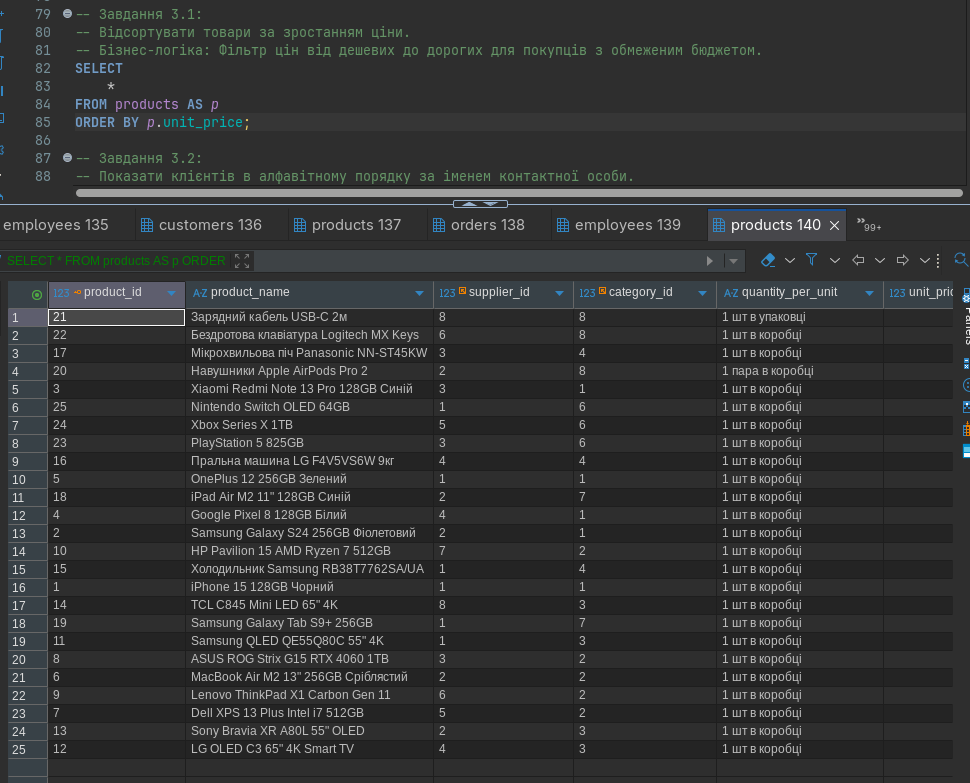

### 1.3.2. Показати клієнтів в алфавітному порядку за іменем контактної особи

```sql
SELECT
    c.customer_id,
    c.contact_name,
    c.city,
    c.phone
FROM customers AS c
ORDER BY c.contact_name;
```

Результат: 15 клієнтів впорядковано за алфавітом контактів. Прискорення навігації та пошуку клієнта оператором кол-центру.

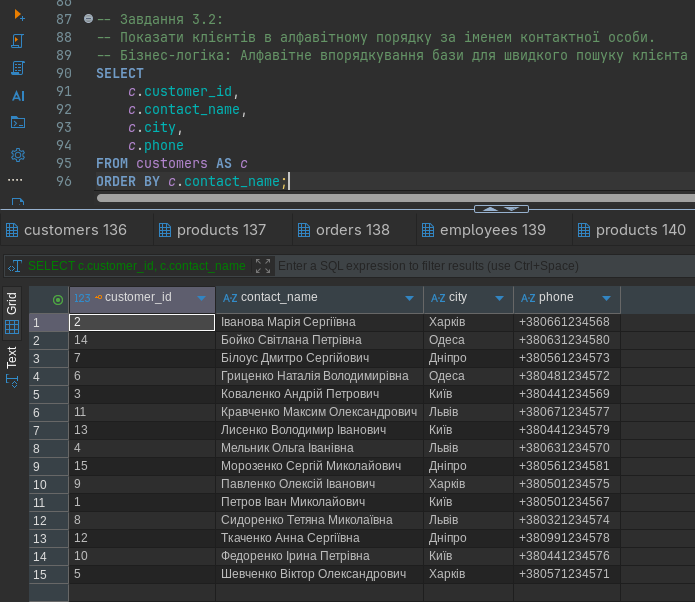

### 1.3.3. Вивести замовлення від найновіших до найстаріших

```sql
SELECT
    *
FROM orders AS o
ORDER BY o.order_date DESC, o.order_id DESC;
```

Результат: 31 замовлення впорядковано у зворотній хронології від серпня до січня 2024 року. Моніторинг поточної операційної активності магазину.

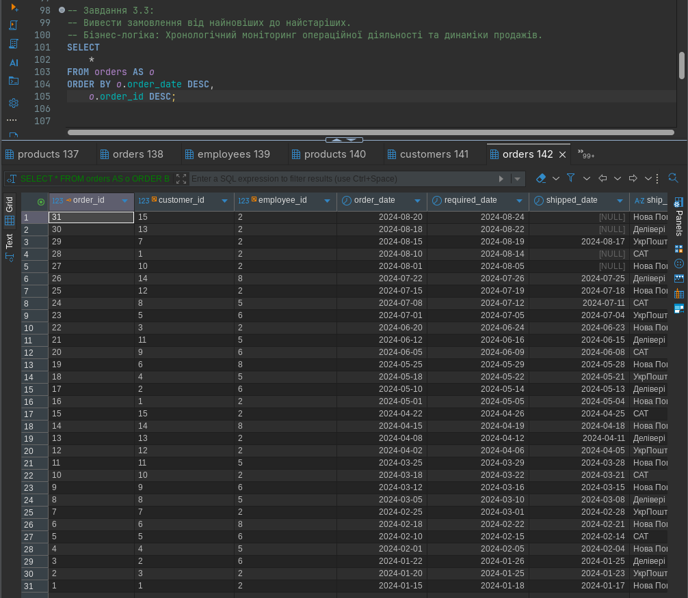

### 1.4.1. Показати перші 10 найдорожчих товарів

```sql
SELECT
    p.product_id,
    p.product_name,
    p.unit_price
FROM products AS p
ORDER BY p.unit_price DESC
LIMIT 10;
```

Результат: Отримано топ-10 найкоштовніших товарів каталогу вартістю від 28 999 до 62 999 грн. Аудит найбільш капіталомістких активів складу.

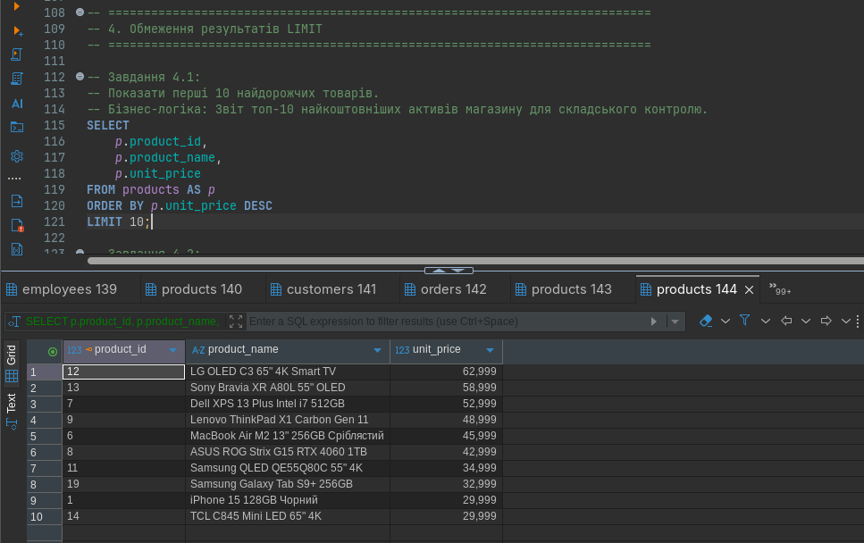

### 1.4.2. Вивести 5 останніх замовлень за датою

```sql
SELECT
    c.contact_name,
    p.product_name,
    oi.quantity,
    oi.unit_price,
    o.order_id,
    o.order_date,
    CONCAT('м. ', o.ship_city, ', ', o.ship_address) AS full_address
FROM orders AS o
INNER JOIN customers AS c
    ON o.customer_id = c.customer_id
INNER JOIN order_items AS oi
    ON o.order_id = oi.order_id
INNER JOIN products AS p
    ON oi.product_id = p.product_id
ORDER BY o.order_date DESC, o.order_id DESC
LIMIT 5;
```

Результат: Отримано деталізовані позиції 5 останніх доставок із замовниками, товарами та адресами. Складський маніфест свіжих відправлень.

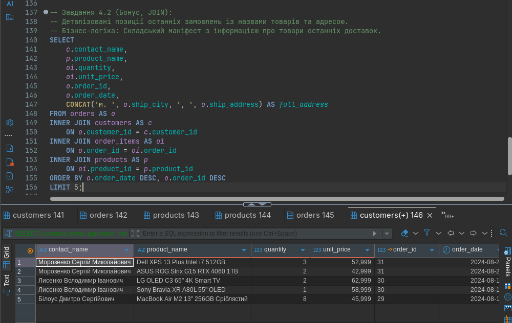

### 1.4.3. Отримати перших 8 клієнтів в алфавітному порядку

```sql
SELECT
    c.customer_id,
    c.contact_name,
    c.city
FROM customers AS c
ORDER BY c.contact_name
LIMIT 8;
```

Результат: Відібрано перші 8 записів алфавітного списку клієнтів. Початкова сторінка реєстру для інтерфейсу CRM-системи.

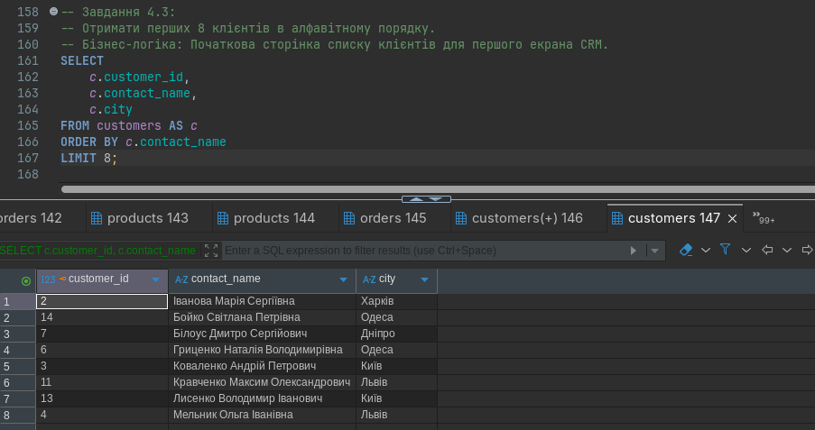

---

### Рівень 2

### 2.1.1. Знайти всіх клієнтів, чиї імена починаються на "Іван"

```sql
SELECT 
    c.customer_id,
    c.contact_name,
    c.city,
    c.phone
FROM customers AS c
WHERE c.contact_name LIKE 'Іван%';
```

Результат: Знайдено 1 запис (Петров Іван Миколайович). Швидкий пошук клієнта менеджером підтримки за неповним іменем під час вхідного дзвінка.

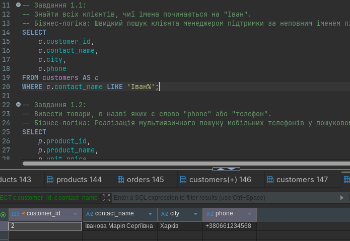

### 2.1.2. Вивести товари, в назві яких є слово "phone" або "телефон"

```sql
SELECT 
    p.product_id,
    p.product_name,
    p.unit_price
FROM products AS p
WHERE p.product_name ILIKE '%телефон%'
    OR p.product_name ILIKE '%phone%';
```

Результат: Отримано 5 моделей смартфонів та аксесуарів. Мультиязичний пошук мобільних телефонів у рядку запитів магазину.

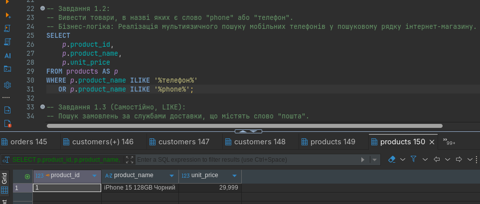

### 2.1.3. Пошук замовлень за службами доставки, що містять слово "пошта"

```sql
SELECT
    o.order_id,
    o.ship_name,
    o.ship_via,
    o.ship_address 
FROM orders AS o
WHERE o.ship_via ILIKE '%пошта%';
```

Результат: Відібрано 13 відправлень перевізниками Нова Пошта та УкрПошта. Оцінка частки поштових служб у загальному логістичному балансі.

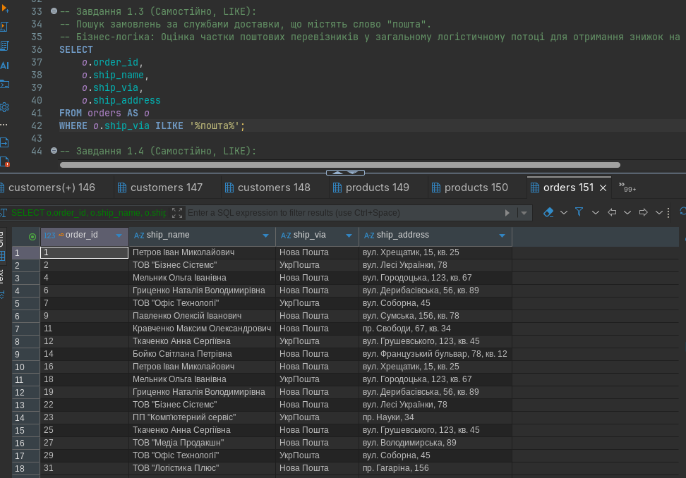

### 2.1.4. Пошук співробітників за фрагментом прізвища "nko" в електронній пошті

```sql
SELECT
    e.employee_id,
    CONCAT(e.first_name, ' ', e.last_name, ' ', e.middle_name) AS fullname,
    e.title AS position,
    e.email
FROM employees AS e
WHERE e.email LIKE '%nko%';
```

Результат: Знайдено 4 співробітників. Швидка адресація корпоративної пошти працівникам за типовим українським суфіксом прізвища.

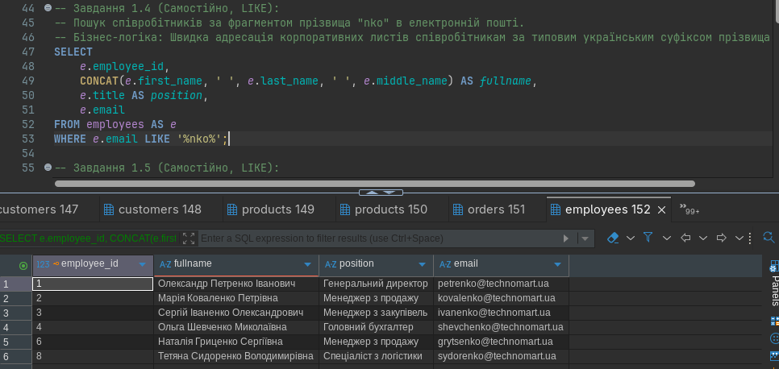

### 2.1.5. Пошук товарів із фіксованим об'ємом накопичувача "256" ГБ

```sql
SELECT
    p.product_id,
    p.product_name,
    p.unit_price
FROM products AS p
WHERE p.product_name LIKE '%256%';
```

Результат: Отримано 4 позиції гаджетів. Маркетинговий аналіз залишків техніки з найбільш затребуваним об'ємом сховища 256GB.

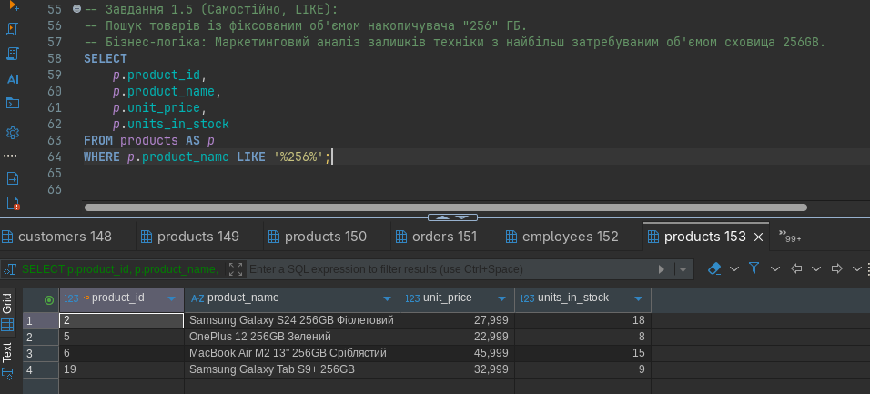

### 2.2.1. Знайти товари дорожчі за 15000 грн і дешевші за 50000 грн

```sql
SELECT 
    p.product_id,
    p.product_name,
    p.quantity_per_unit,
    p.unit_price
FROM products AS p
WHERE p.unit_price > 15000
    AND p.unit_price < 50000;
```

Результат: Отримано 11 товарів середньо-високого цінового сегмента. Виділення комерційного ядра техніки для запуску таргетованої реклами.

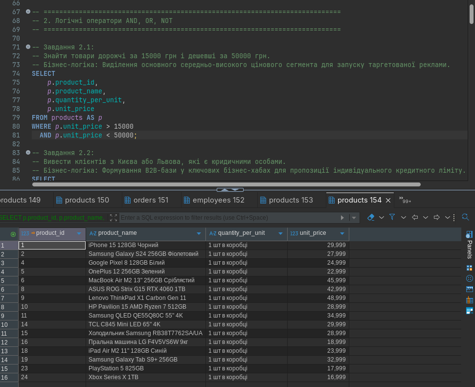

### 2.2.2. Вивести клієнтів з Києва або Львова, які є юридичними особами

```sql
SELECT
    c.customer_id,
    c.company_name,
    c.contact_name,
    c.contact_title,
    c.city,
    c.email,
    c.customer_type
FROM customers AS c
WHERE (c.city = 'Київ' OR c.city = 'Львів')
    AND c.company_name IS NOT NULL
    AND c.customer_type = 'company';
```

Результат: Знайдено 3 корпоративні клієнти у двох найбільших хабах. Формування B2B-бази для відкриття кредитних лімітів на закупівлі.

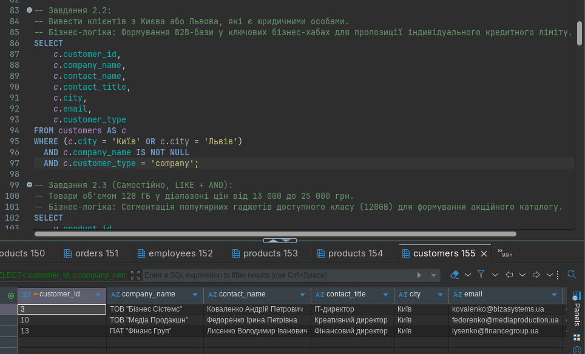

### 2.2.3. Товари об'ємом 128 ГБ у діапазоні цін від 13 000 до 25 000 грн

```sql
SELECT
    p.product_id,
    p.product_name,
    p.quantity_per_unit,
    p.unit_price,
    p.units_on_order
FROM products AS p
WHERE p.product_name LIKE '%128%'
    AND p.unit_price > 13000
    AND p.unit_price < 25000;
```

Результат: Відібрано 2 моделі гаджетів. Сегментація популярних пристроїв пам'яттю 128GB для акційного каталогу.

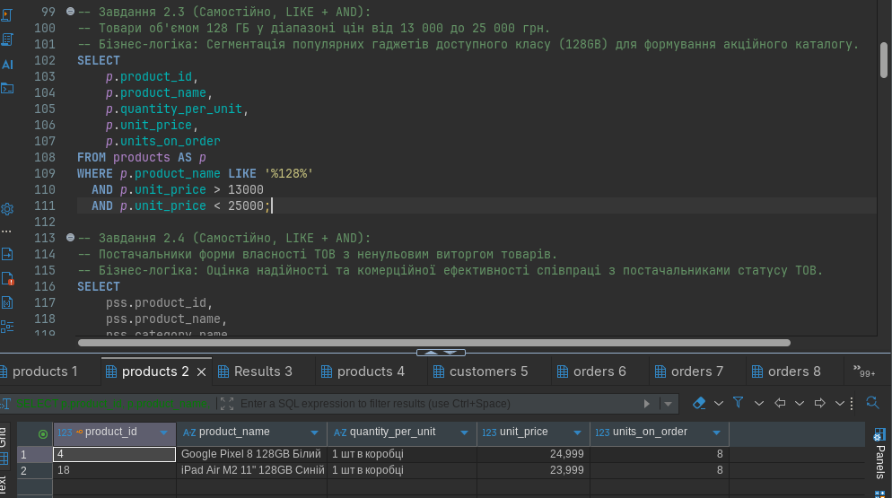

### 2.2.4. Постачальники форми власності ТОВ з ненульовим виторгом товарів

```sql
SELECT
    pss.product_id,
    pss.product_name,
    pss.category_name,
    pss.supplier_name,
    pss.unit_price,
    pss.total_revenue,
    pss.order_count
FROM product_sales_summary AS pss
WHERE pss.supplier_name LIKE '%ТОВ%'
    AND pss.total_revenue != 0;
```

Результат: Отримано 11 позицій продукції від постачальників статусу ТОВ. Оцінка надійності та фінансової віддачі партнерів.

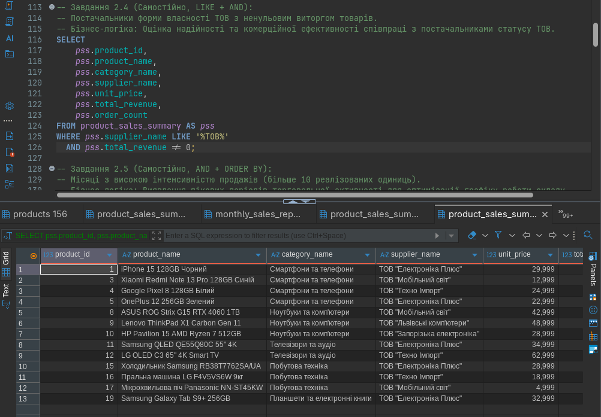

### 2.2.5. Місяці з високою інтенсивністю продажів (більше 10 одиниць)

```sql
SELECT 
    msr.year_month,
    msr.orders_count,
    msr.unique_customers,
    msr.total_items,
    msr.total_revenue
FROM monthly_sales_report AS msr
WHERE msr.total_items > 10
ORDER BY msr.total_items DESC;
```

Результат: Виявлено 5 пікових місяців продажів у 2024 році. Планування графіків роботи складу та своєчасного поповнення запасів.

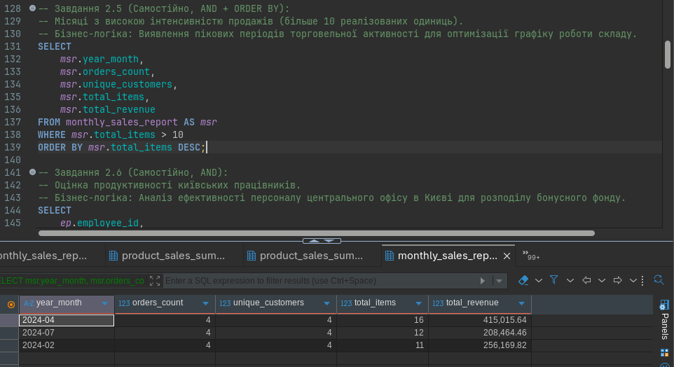

### 2.2.6. Оцінка продуктивності київських працівників

```sql
SELECT 
    ep.employee_id,
    ep.full_name,
    ep.title AS job_position,
    ep.city
FROM employee_performance AS ep
WHERE ep.city = 'Київ';
```

Результат: Отримано показники 4 співробітників центрального офісу. Аналіз ефективності праці для розподілу квартального бонусного фонду.

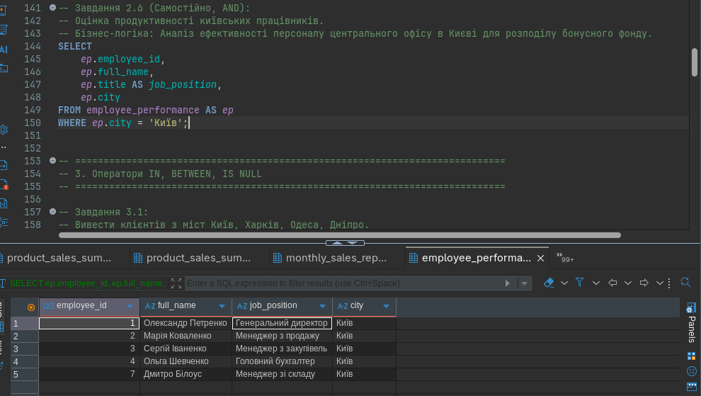

### 2.3.1. Вивести клієнтів з міст Київ, Харків, Одеса, Дніпро

```sql
SELECT
    c.customer_id,
    c.contact_name,
    c.company_name,
    c.city,
    c.phone,
    c.customer_type
FROM customers AS c
WHERE c.city IN ('Київ', 'Харків', 'Одеса', 'Дніпро');
```

Результат: Відібрано 13 клієнтів з міст-мільйонників України. Фокусування маркетингу на найбільш платоспроможних ринках.

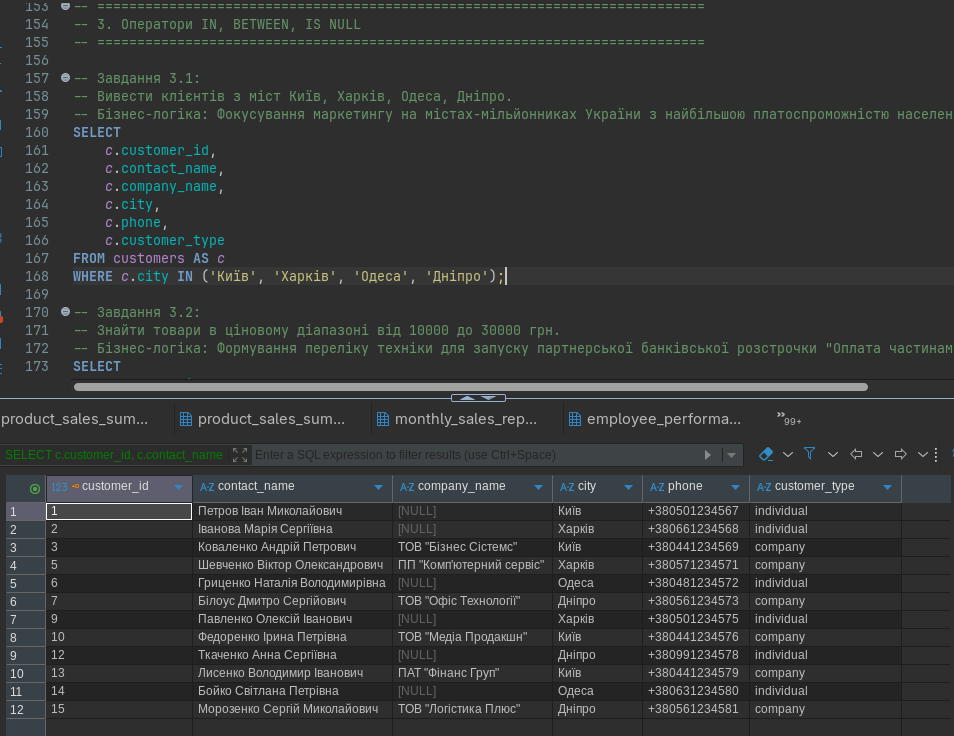

### 2.3.2. Знайти товари в ціновому діапазоні від 10000 до 30000 грн

```sql
SELECT
    p.product_id,
    p.product_name,
    p.quantity_per_unit,
    p.unit_price
FROM products AS p
WHERE p.unit_price BETWEEN 10000 AND 30000;
```

Результат: Отримано 12 моделей техніки. Формування переліку товарів під банківську програму розстрочки "Оплата частинами".

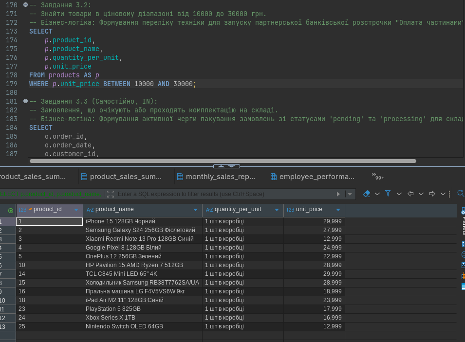

### 2.3.3. Замовлення, що очікують або проходять комплектацію на складі

```sql
SELECT
    o.order_id,
    o.order_date,
    o.customer_id,
    o.order_status,
    o.ship_city,
    o.ship_via
FROM orders AS o
WHERE o.order_status IN ('pending', 'processing')
ORDER BY o.order_date;
```

Результат: Отримано 6 незавершених замовлень. Формування поточної черги комплектації та пакування для співробітників складу.

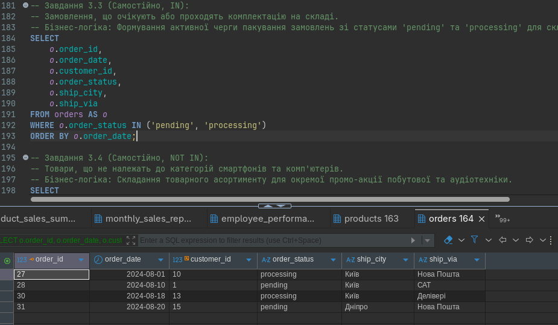

### 2.3.4. Товари, що не належать до категорій смартфонів та комп'ютерів

```sql
SELECT
    p.product_id,
    p.product_name,
    p.category_id,
    p.unit_price,
    p.units_in_stock
FROM products AS p
WHERE p.category_id NOT IN (1, 2)
ORDER BY p.category_id, p.unit_price DESC;
```

Результат: Відібрано 15 товарів побутової, аудіо- та телевізійної техніки. Складання асортименту для окремої промо-акції.

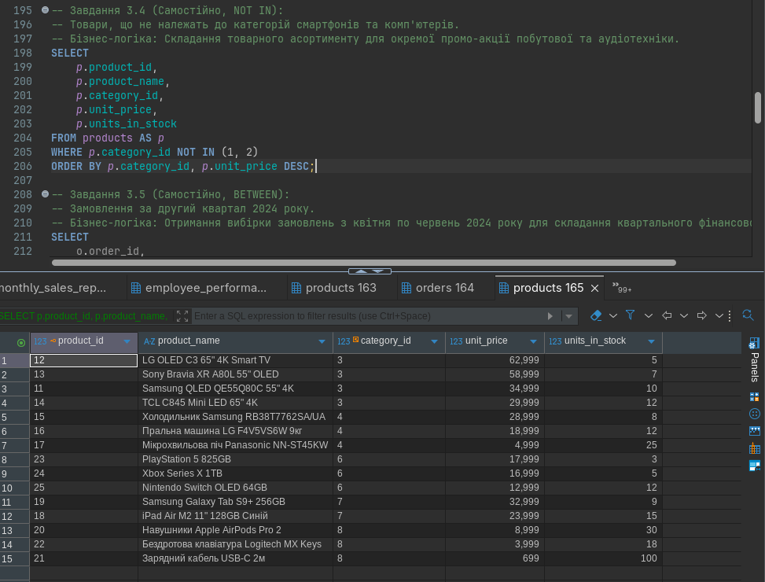

### 2.3.5. Замовлення за другий квартал 2024 року

```sql
SELECT
    o.order_id,
    o.order_date,
    o.order_status,
    o.ship_city,
    o.freight
FROM orders AS o
WHERE o.order_date BETWEEN '2024-04-01' AND '2024-06-30'
ORDER BY o.order_date;
```

Результат: Отримано 9 замовлень з квітня по червень 2024 року. Підготовка даних для складання квартального фінансового звіту.

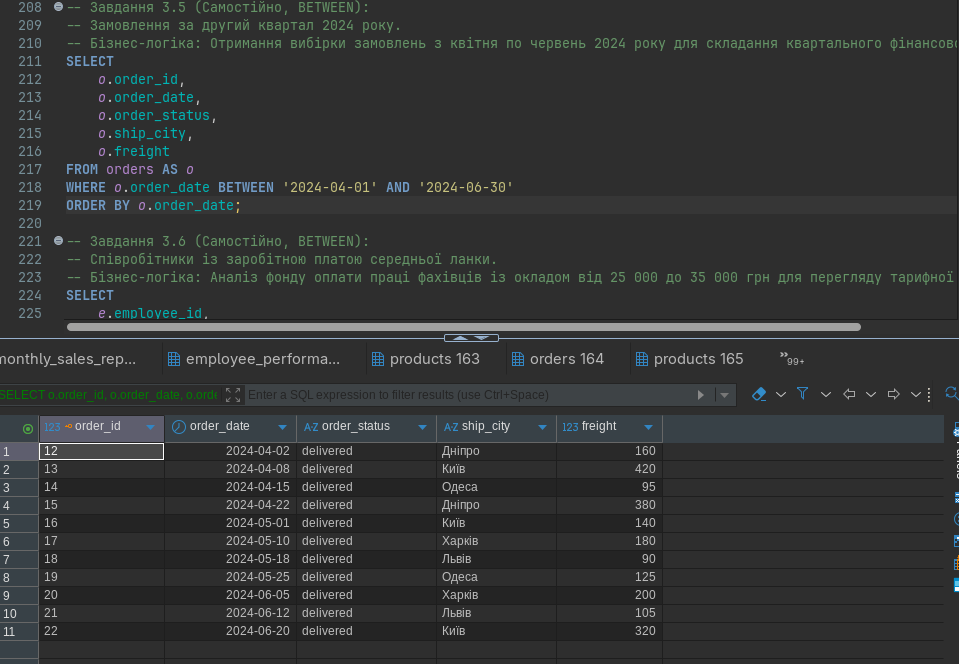

### 2.3.6. Співробітники із заробітною платою середньої ланки (25 000 - 35 000 грн)

```sql
SELECT
    e.employee_id,
    e.first_name,
    e.last_name,
    e.title,
    e.salary
FROM employees AS e
WHERE e.salary BETWEEN 25000 AND 35000
ORDER BY e.salary DESC;
```

Результат: Відібрано 4 фахівців ключових підрозділів. Аналіз фонду оплати праці спеціалістів середньої кваліфікаційної ланки.

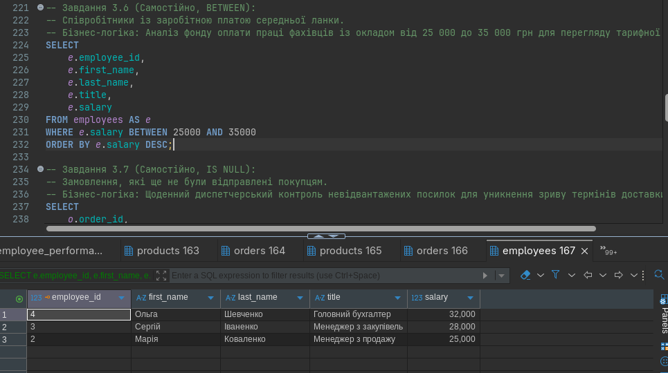

### 2.3.7. Замовлення, які ще не були відправлені покупцям

```sql
SELECT
    o.order_id,
    o.customer_id,
    o.order_date,
    o.required_date,
    o.order_status,
    o.ship_city
FROM orders AS o
WHERE o.shipped_date IS NULL
ORDER BY o.order_date;
```

Результат: Знайдено 4 невідвантажені відправлення. Щоденний диспетчерський контроль посилок для уникнення зриву термінів доставки.

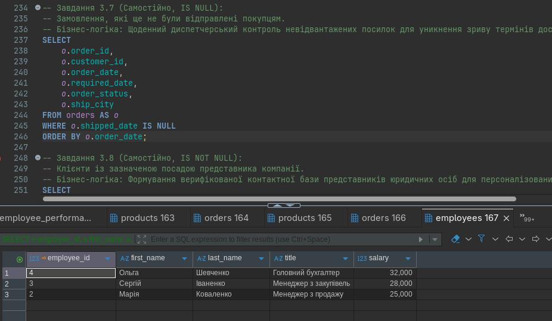

### 2.3.8. Клієнти із зазначеною посадою представника компанії

```sql
SELECT
    c.customer_id,
    c.contact_name,
    c.contact_title AS job_position,
    c.city,
    CONCAT('м. ', c.city, ', ', c.address) AS full_address
FROM customers AS c
WHERE c.contact_title IS NOT NULL
ORDER BY c.city, c.contact_name;
```

Результат: Отримано 8 підтверджених контактних осіб організацій. Формування персоналізованої контактної бази для B2B-переговорів.

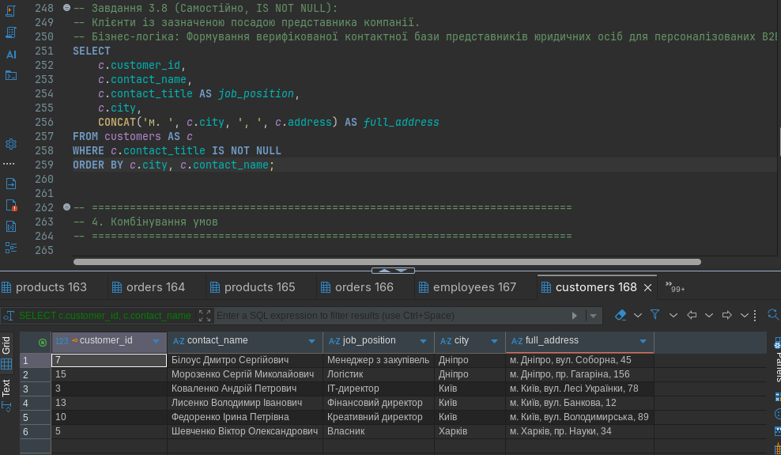

### 2.4.1. Активні товари топових брендів у наявності

```sql
SELECT
    p.product_id,
    p.product_name,
    p.unit_price,
    p.units_in_stock
FROM products AS p
WHERE (p.product_name ILIKE '%Apple%' OR p.product_name ILIKE '%Samsung%')
    AND p.units_in_stock > 0
    AND p.discontinued = false
ORDER BY p.unit_price DESC;
```

Результат: Відібрано 7 наявних флагманських гаджетів Apple та Samsung. Промо-кампанія топових брендів без ризику дефіциту на складі.

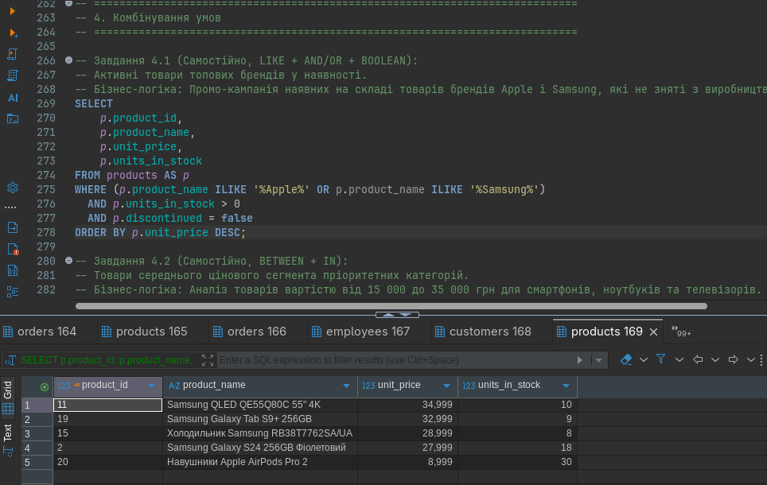

### 2.4.2. Товари середнього цінового сегмента пріоритетних категорій

```sql
SELECT
    p.product_id,
    p.product_name,
    p.category_id,
    p.unit_price,
    p.units_in_stock
FROM products AS p
WHERE p.unit_price BETWEEN 15000 AND 35000
    AND p.category_id IN (1, 2, 3)
ORDER BY p.category_id, p.unit_price DESC;
```

Результат: Отримано 8 моделей техніки категорій 1, 2, 3 вартістю від 15 000 до 35 000 грн. Аналіз структури масового попиту.

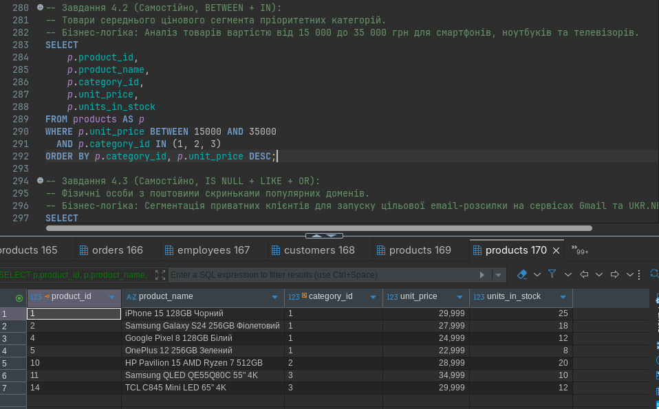

### 2.4.3. Фізичні особи з поштовими скриньками Gmail та Ukr.net

```sql
SELECT
    c.customer_id,
    c.contact_name,
    c.city,
    c.email
FROM customers AS c
WHERE c.company_name IS NULL
    AND (c.email LIKE '%@gmail.com' OR c.email LIKE '%@ukr.net')
ORDER BY c.city, c.contact_name;
```

Результат: Знайдено 6 приватних клієнтів. Сегментація аудиторії для запуску промо-розсилок через популярні поштові сервіси.

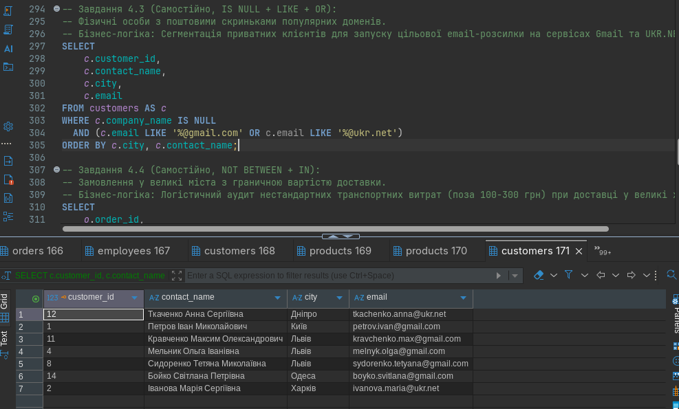

### 2.4.4. Замовлення у великі міста з граничною вартістю доставки

```sql
SELECT
    o.order_id,
    o.ship_city,
    o.ship_via,
    o.freight,
    o.order_status
FROM orders AS o
WHERE o.ship_city IN ('Київ', 'Дніпро', 'Львів')
    AND o.freight NOT BETWEEN 100 AND 300
ORDER BY o.freight DESC;
```

Результат: Знайдено 4 відправлення з вартістю доставки понад 300 грн. Логістичний аудит нестандартних транспортних витрат.

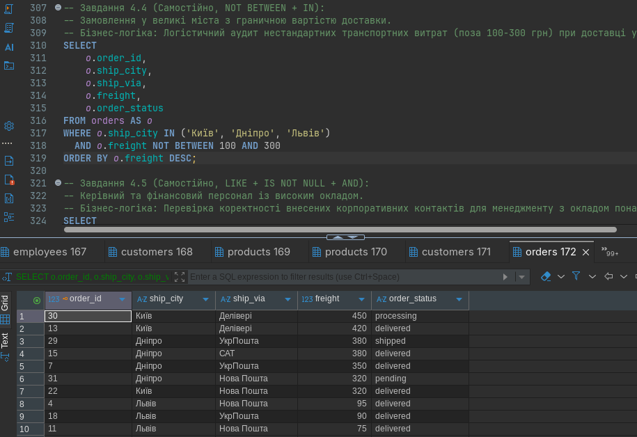

### 2.4.5. Керівний та фінансовий персонал із високим окладом

```sql
SELECT
    e.employee_id,
    e.first_name,
    e.last_name,
    e.title,
    e.salary,
    e.email
FROM employees AS e
WHERE (e.title ILIKE '%директор%' OR e.title ILIKE '%бухгалтер%')
    AND e.salary > 30000
    AND e.email IS NOT NULL
ORDER BY e.salary DESC;
```

Результат: Відібрано 2 керівників (Генеральний директор і Головний бухгалтер). Перевірка корпоративних даних топ-менеджменту.

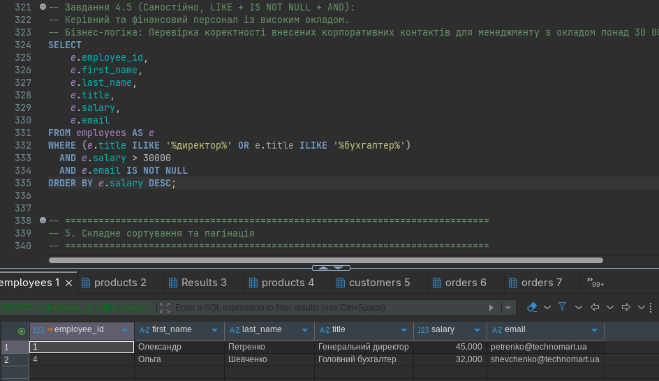

### 2.5.1. Каталог товарів за категорією та ціною

```sql
SELECT
    p.product_id,
    p.product_name,
    p.category_id,
    p.unit_price,
    p.units_in_stock
FROM products AS p
ORDER BY p.category_id, p.unit_price DESC;
```

Результат: 25 позицій структуровано за категоріями з показом найдорожчих товарів на початку кожної групи.

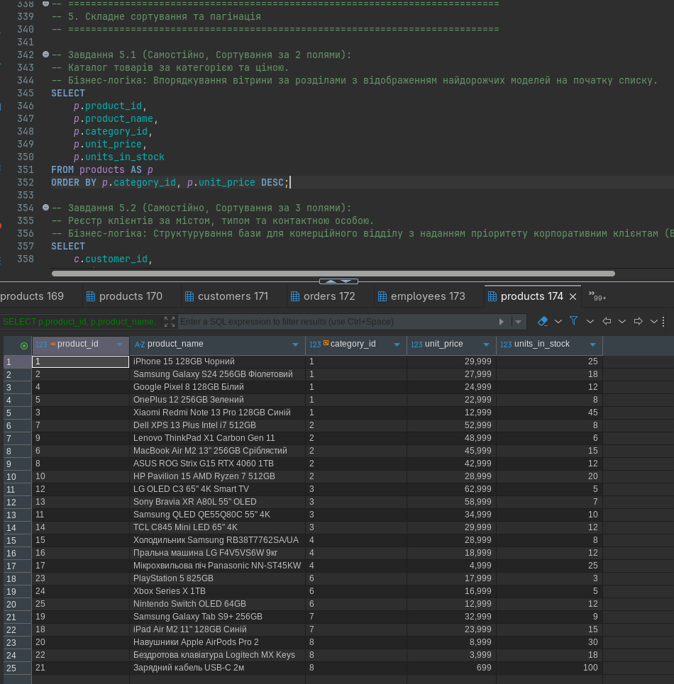

### 2.5.2. Реєстр клієнтів за містом, типом та контактною особою

```sql
SELECT
    c.customer_id,
    c.city,
    c.customer_type,
    c.company_name,
    c.contact_name,
    c.phone
FROM customers AS c
ORDER BY c.city, c.customer_type DESC, c.contact_name;
```

Результат: 15 клієнтів згруповано за географією з першочерговим показом корпоративних B2B-контрагентів.

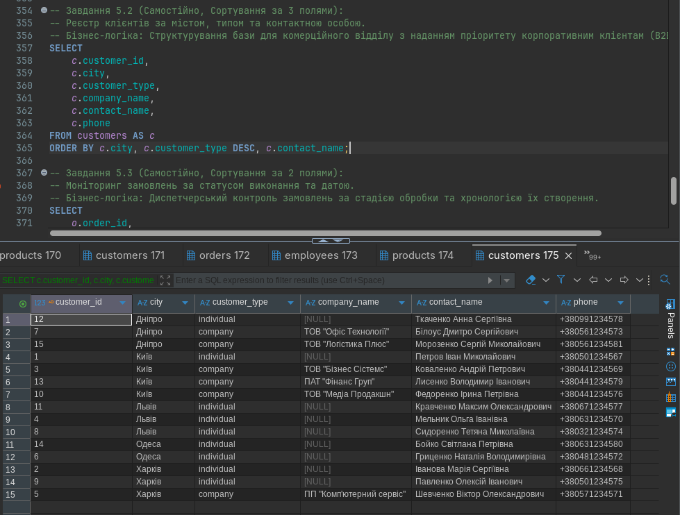

### 2.5.3. Моніторинг замовлень за статусом виконання та датою

```sql
SELECT
    o.order_id,
    o.order_status,
    o.order_date,
    o.customer_id,
    o.ship_city,
    o.freight
FROM orders AS o
ORDER BY o.order_status, o.order_date DESC, o.order_id DESC;
```

Результат: 31 замовлення згруповано за статусами обробки із сортуванням від свіжих до старіших у кожній групі.

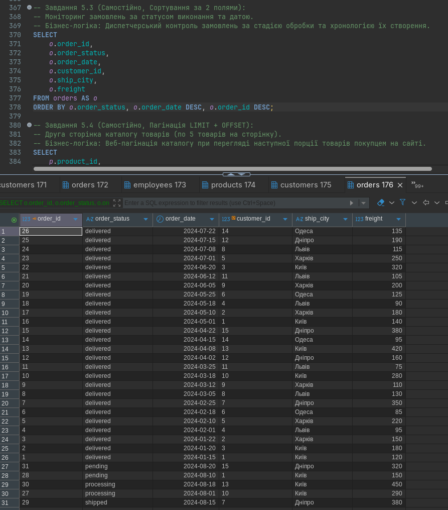

### 2.5.4. Друга сторінка каталогу товарів (LIMIT 5 OFFSET 5)

```sql
SELECT
    p.product_id,
    p.product_name,
    p.unit_price,
    p.units_in_stock
FROM products AS p
ORDER BY p.unit_price DESC, p.product_id
LIMIT 5 OFFSET 5;
```

Результат: Отримано позиції з 6 по 10 найдорожчих товарів каталогу. Реалізація веб-пагінації для клієнтського інтерфейсу.

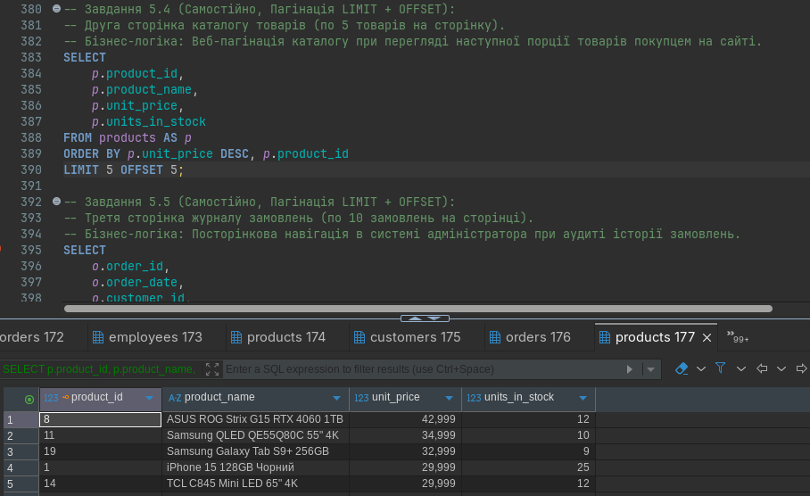

### 2.5.5. Третя сторінка журналу замовлень (LIMIT 10 OFFSET 20)

```sql
SELECT
    o.order_id,
    o.order_date,
    o.customer_id,
    o.order_status,
    o.ship_city,
    o.freight
FROM orders AS o
ORDER BY o.order_date DESC, o.order_id DESC
LIMIT 10 OFFSET 20;
```

Результат: Отримано замовлення з 21 по 30 у списку хронології. Посторінкова навігація при роботі з великими масивами даних.

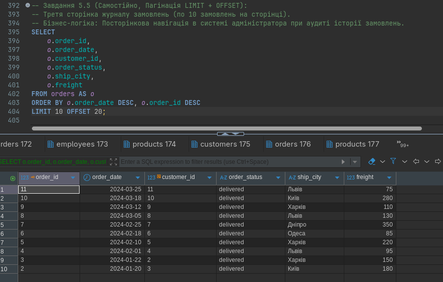

---

### Рівень 3

### 3.1.1. Товари брендів Samsung або Apple без чохлів

```sql
SELECT
    p.product_id,
    p.product_name,
    p.category_id,
    p.quantity_per_unit,
    p.unit_price,
    p.description
FROM products AS p
WHERE (p.product_name ILIKE '%samsung%'
    OR p.product_name ILIKE '%apple%')
    AND p.product_name NOT ILIKE '%чохол%';
```

Результат: Відібрано 6 гаджетів Samsung та Apple. Виділення флагманських пристроїв без супутніх дрібних аксесуарів для підрахунку продажів.

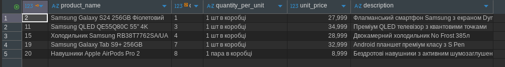

### 3.1.2. Флагманські модифікації Pro, Max, Plus без чохлів

```sql
SELECT
    p.product_id,
    p.product_name,
    p.unit_price,
    p.units_in_stock
FROM products AS p
WHERE (p.product_name ILIKE '%Pro%'
    OR p.product_name ILIKE '%Max%'
    OR p.product_name ILIKE '%Plus%')
    AND p.product_name NOT ILIKE '%чохол%'
ORDER BY p.unit_price DESC;
```

Результат: Отримано 5 топових моделей електроніки. Виділення розширених модифікацій для преміального маркетингу.

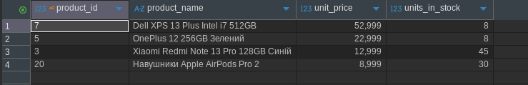

### 3.1.3. Керуючий персонал не з відділу продажів

```sql
SELECT
    e.employee_id,
    CONCAT(e.first_name, ' ', e.last_name) AS fullname,
    e.title AS job_position,
    e.email
FROM employees AS e
WHERE (e.title ILIKE '%менеджер%'
    OR e.title ILIKE '%спеціаліст%')
    AND e.title NOT ILIKE '%продаж%'
ORDER BY e.employee_id;
```

Результат: Відібрано 3 керівників та логістів. Формування списку адміністративного персоналу для проходження технічного аудиту.

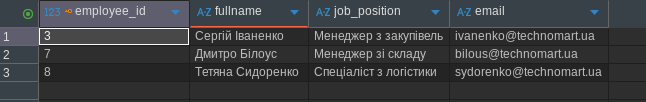

### 3.1.4. Замовлення з доставкою до квартир через поштових операторів

```sql
SELECT
    o.order_id,
    o.ship_name,
    o.ship_via,
    o.ship_city,
    o.ship_address
FROM orders AS o
WHERE (o.ship_via ILIKE '%Нова Пошта%'
    OR o.ship_via ILIKE '%Делівері%')
    AND o.ship_address ILIKE '%кв.%'
    AND o.ship_address NOT ILIKE '%пр.%'
ORDER BY o.order_id DESC;
```

Результат: Отримано 7 адресних замовлень. Аналіз попиту на кур'єрський підйом великогабаритних посилок на поверх у житлових будинках.

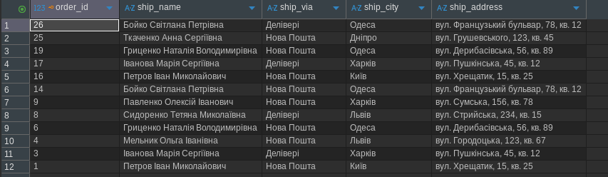

### 3.1.5. Клієнти Vodafone без пошти Gmail

```sql
SELECT
    c.customer_id,
    c.contact_name,
    c.phone,
    c.email,
    c.city
FROM customers AS c
WHERE (c.phone LIKE '+38050%'
    OR c.phone LIKE '+38066%')
    AND c.email NOT LIKE '%@gmail.com'
ORDER BY c.customer_id;
```

Результат: Знайдено 1 клієнта. Сегментація бази для запуску таргетованої SMS-кампанії без дублювання в промо-каналах Gmail.

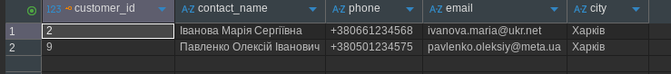

### 3.2.1. Товари дорожчі за 20000 грн (кат. 1, 2) або дешевші за 5000 грн

```sql
SELECT
    p.product_id,
    p.product_name,
    p.category_id,
    p.unit_price
FROM products AS p
WHERE (p.unit_price > 20000
    AND p.category_id IN (1, 2))
    OR (p.unit_price < 5000);
```

Результат: Отримано 10 позицій. Формування асортиментної вибірки преміальної техніки та товарів першої ціни для контрастної вітрини.

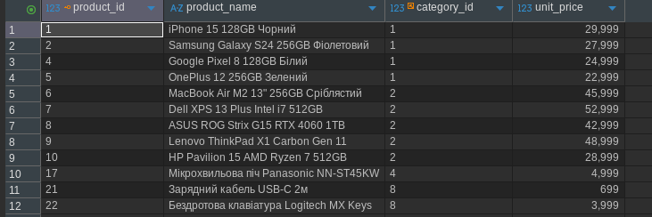

### 3.2.2. Проблемні або термінові замовлення для диспетчера

```sql
SELECT
    o.order_id,
    o.order_date,
    o.order_status,
    o.ship_city,
    o.freight
FROM orders AS o
WHERE (o.order_status = 'pending'
    AND o.order_date < '2024-08-15')
    OR (o.order_status = 'processing'
    AND o.freight > 300)
ORDER BY o.order_date;
```

Результат: Знайдено 2 замовлення. Контроль посилок, що зависли в очікуванні, або дорогих відправлень в обробці з підвищеною вартістю доставки.

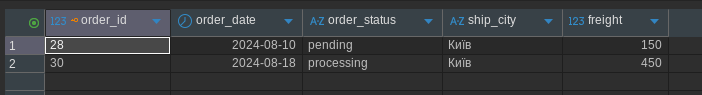

### 3.2.3. Пріоритетні категорії клієнтів для комерційного відділу

```sql
SELECT
    c.customer_id,
    c.customer_type,
    c.company_name,
    c.contact_name,
    c.city,
    c.email
FROM customers AS c
WHERE (c.customer_type = 'company'
    AND c.city IN ('Київ', 'Дніпро'))
    OR (c.customer_type = 'individual'
    AND c.city = 'Львів'
    AND c.email LIKE '%@gmail.com')
ORDER BY c.city, c.customer_type DESC;
```

Результат: Відібрано 5 клієнтів. Складання списку B2B-компаній у бізнес-центрах та активних приватних клієнтів західного регіону.

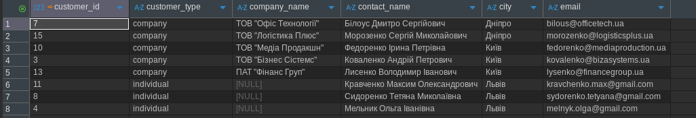

### 3.2.4. Критичні складські залишки та високовартісні поставки

```sql
SELECT
    p.product_id,
    p.product_name,
    p.unit_price,
    p.units_in_stock,
    p.reorder_level,
    p.units_on_order
FROM products AS p
WHERE (p.units_in_stock <= p.reorder_level
    AND p.discontinued = false)
    OR (p.unit_price > 40000
    AND p.units_on_order > 0)
ORDER BY p.unit_price DESC;
```

Результат: Знайдено 3 товари. Виявлення позицій з мінімальним залишком або преміальної техніки, що вже прямує від постачальників.

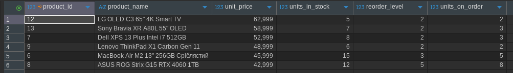

### 3.3.1. Звіт активного асортименту з 6 умовами фільтрації

```sql
SELECT
    p.product_id,
    p.product_name,
    p.category_id,
    p.unit_price,
    p.units_in_stock,
    p.reorder_level
FROM products AS p
WHERE p.unit_price BETWEEN 10000 AND 50000
    AND p.category_id IN (1, 2, 3)
    AND p.units_in_stock > 5
    AND p.discontinued = false
    AND p.reorder_level >= 2
    AND p.product_name NOT ILIKE '%чохол%'
ORDER BY p.unit_price DESC;
```

Результат: Відібрано 7 позицій ходової електроніки. Багатофакторний аудит техніки в наявності для планування безперервного ланцюга постачань.

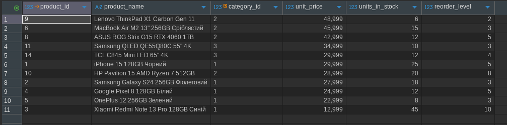

### 3.3.2. Надійні корпоративні клієнти у ключових бізнес-регіонах

```sql
SELECT
    c.customer_id,
    c.company_name,
    c.contact_name,
    c.city,
    c.phone,
    c.email
FROM customers AS c
WHERE c.customer_type = 'company'
    AND c.city IN ('Київ', 'Дніпро', 'Харків')
    AND c.phone LIKE '+380%'
    AND c.email IS NOT NULL
    AND c.contact_title IS NOT NULL
    AND c.address NOT ILIKE '%а/с%'
ORDER BY c.city, c.contact_name;
```

Результат: Отримано 7 верифікованих підприємств. Формування перевіреної B2B-бази з реальними офісами для укладання рамкових договорів.

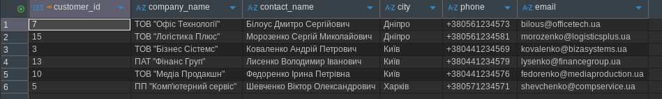

### 3.4.1. Бюджетні товари та вартість залишку на складі

```sql
SELECT
    p.product_id,
    p.product_name,
    p.unit_price,
    p.units_in_stock,
    (p.unit_price * p.units_in_stock) AS inventory_value
FROM products AS p
WHERE p.unit_price < 5000
ORDER BY p.unit_price;
```

Результат: Отримано 4 бюджетні товари з підрахованою капіталізацією залишку на складі для оптимізації обігових коштів.

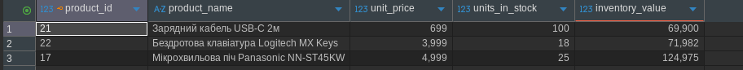

### 3.4.2. Товари середнього цінового сегмента від 10 000 до 30 000 грн

```sql
SELECT
    p.product_id,
    p.product_name,
    p.category_id,
    p.unit_price,
    p.units_in_stock
FROM products AS p
WHERE p.unit_price BETWEEN 10000 AND 30000
    AND p.units_in_stock > 0
ORDER BY p.unit_price DESC;
```

Результат: Відібрано 12 позицій техніки у наявності. Аналіз товарного ядра під споживчі акції та партнерські програми розстрочки.

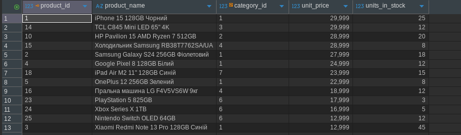

### 3.4.3. Преміальна техніка понад 45 000 грн

```sql
SELECT
    p.product_id,
    p.product_name,
    p.unit_price,
    p.units_in_stock,
    p.units_on_order
FROM products AS p
WHERE p.unit_price > 45000
ORDER BY p.unit_price DESC;
```

Результат: Отримано 5 ексклюзивних моделей. Контроль залишків високомаржинальної техніки для персональних пропозицій VIP-клієнтам.

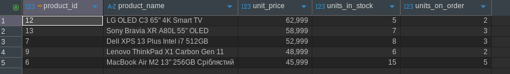

### 3.4.4. Клієнтська база Києва з розподілом за типами контрагентів

```sql
SELECT
    c.customer_id,
    c.customer_type,
    c.company_name,
    c.contact_name,
    c.address,
    c.phone
FROM customers AS c
WHERE c.city = 'Київ'
ORDER BY c.customer_type DESC, c.contact_name;
```

Результат: Отримано 4 столичні клієнти (B2B та B2C). Оцінка концентрації покупців для визначення доцільності відкриття нового пункту видачі.

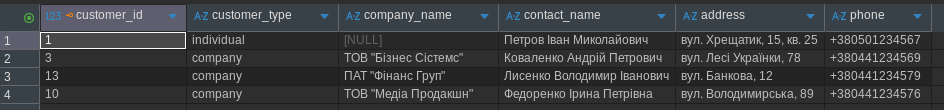

### 3.4.5. Клієнтська активність у Львові

```sql
SELECT
    c.customer_id,
    c.customer_type,
    c.contact_name,
    c.address,
    c.phone
FROM customers AS c
WHERE c.city = 'Львів'
ORDER BY c.contact_name;
```

Результат: Відібрано 3 клієнти. Аналіз попиту в західному регіоні для оптимізації логістичного плеча львівського хабу.

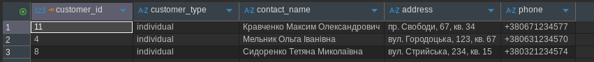

### 3.4.6. Клієнти з промислових центрів (Дніпро, Харків, Одеса)

```sql
SELECT
    c.customer_id,
    c.city,
    c.customer_type,
    c.company_name,
    c.contact_name
FROM customers AS c
WHERE c.city IN ('Дніпро', 'Харків', 'Одеса')
ORDER BY c.city, c.customer_type DESC;
```

Результат: Отримано 9 клієнтів. Оцінка ринкової присутності магазину у великих індустріальних центрах України.

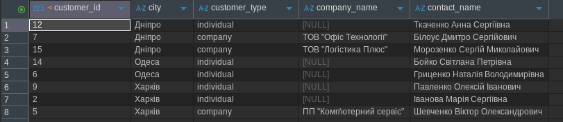

### 3.4.7. Підприємства та організації поза межами столиці

```sql
SELECT
    c.customer_id,
    c.city,
    c.company_name,
    c.contact_name,
    c.contact_title,
    c.phone
FROM customers AS c
WHERE c.customer_type = 'company'
    AND c.city != 'Київ'
ORDER BY c.city, c.company_name;
```

Результат: Відібрано 4 регіональні компанії. Вивчення потенціалу розвитку дистриб'юторської B2B-мережі без урахування київського офісу.

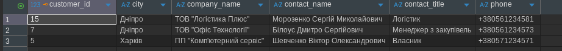

### 3.4.8. Замовлення з швидкою доставкою до 3 днів

```sql
SELECT
    o.order_id,
    o.order_date,
    o.shipped_date,
    (o.shipped_date - o.order_date) AS delivery_days,
    o.ship_via,
    o.ship_city
FROM orders AS o
WHERE o.shipped_date IS NOT NULL
    AND (o.shipped_date - o.order_date) <= 3
ORDER BY delivery_days, o.order_date DESC;
```

Результат: Отримано 18 замовлень. Моніторинг дотримання стандартів швидкої комплектації та доставки для надійних перевізників.

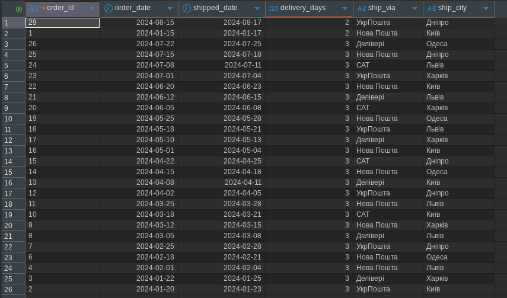

### 3.4.9. Замовлення літнього періоду 2024 року

```sql
SELECT
    o.order_id,
    o.order_date,
    o.customer_id,
    o.order_status,
    o.freight
FROM orders AS o
WHERE o.order_date BETWEEN '2024-06-01' AND '2024-08-31'
ORDER BY o.order_date;
```

Результат: Відібрано 8 замовлень за літній торговельний сезон. Аналіз динаміки попиту для коригування планів закупівель.

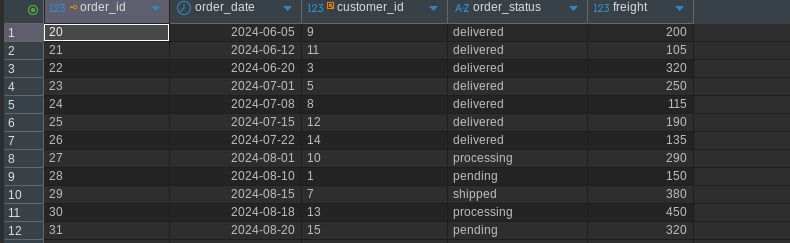

### 3.4.10. Невідвантажені замовлення для диспетчерського контролю

```sql
SELECT
    o.order_id,
    o.order_date,
    o.required_date,
    o.order_status,
    o.ship_city
FROM orders AS o
WHERE o.shipped_date IS NULL
ORDER BY o.order_date;
```

Результат: Знайдено 4 активні замовлення без дати відвантаження. Диспетчерський контроль термінів комплектації для уникнення скарг.

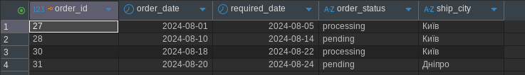

### 3.5.1. Автоматична категоризація за ціновими класами та ПДВ

```sql
SELECT
    p.product_id,
    p.product_name,
    p.unit_price,
    ROUND(p.unit_price * 1.20, 2) AS price_with_vat,
    CASE
        WHEN p.unit_price < 5000 THEN 'Бюджетний'
        WHEN p.unit_price < 25000 THEN 'Оптимум'
        WHEN p.unit_price < 50000 THEN 'Преміум'
        ELSE 'Люкс'
    END AS price_tier
FROM products AS p
ORDER BY p.unit_price DESC;
```

Результат: 25 товарів розбито за ціновими рівнями з розрахованою ставкою ПДВ 20%. Автоматизація ціноутворення та навігації.

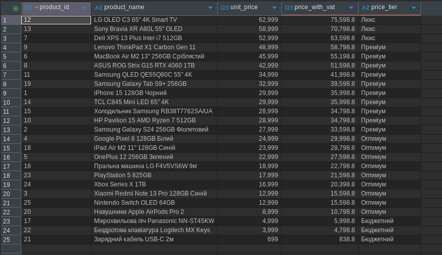

### 3.5.2. Ділова картка співробітника та планова винагорода

```sql
SELECT
    e.employee_id,
    CONCAT(e.last_name, ' ', e.first_name, ' (', e.title, ')') AS employee_badge,
    e.salary,
    ROUND(e.salary * 1.15, 2) AS projected_salary_with_bonus,
    COALESCE(e.reports_to::text, 'Керівник відсутній (Топ-менеджер)') AS manager_id
FROM employees AS e
ORDER BY e.salary DESC;
```

Результат: Отримано дані 8 працівників з розрахованою надбавкою 15% та обробленими значеннями керівництва через COALESCE.

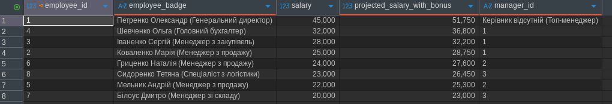

### 3.5.3. Аудит якості та повноти контактних реквізитів контрагентів

```sql
SELECT
    c.customer_id,
    c.contact_name,
    c.phone,
    c.email,
    c.postal_code,
    LENGTH(c.phone) AS phone_length
FROM customers AS c
WHERE LENGTH(c.phone) < 13
    OR c.postal_code IS NULL
    OR c.email IS NULL
ORDER BY c.customer_id;
```

Результат: 0 рядків. Повна відповідність контактних даних стандарту E.164 (довжина 13 символів) та відсутність пропусків NULL у базі.


### 3.5.4. Пріоритетне відображення доступних товарів на вітрині

```sql
SELECT
    p.product_id,
    p.product_name,
    p.unit_price,
    p.units_in_stock,
    CASE 
        WHEN p.units_in_stock > 0 THEN 'В наявності' 
        ELSE 'Під замовлення' 
    END AS stock_availability
FROM products AS p
ORDER BY 
    CASE WHEN p.units_in_stock > 0 THEN 0 ELSE 1 END,
    p.unit_price DESC;
```

Результат: 25 товарів впорядковано за наявністю: доступні позиції відображаються першими, а дефіцитні зміщуються в кінець списку.

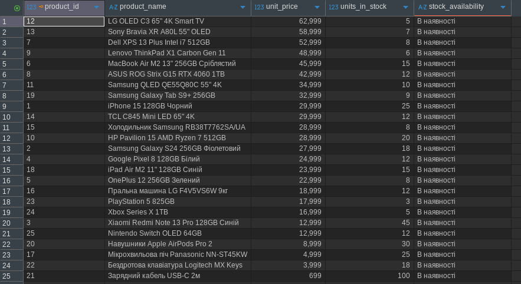

### 3.5.5. Логістичний аудит вартості доставки з ПДВ

```sql
SELECT
    o.order_id,
    o.order_date,
    o.ship_city,
    o.ship_via,
    o.freight,
    ROUND(o.freight * 1.20, 2) AS freight_with_tax,
    COALESCE(o.shipped_date::text, 'В очікуванні відправки') AS shipment_status
FROM orders AS o
WHERE o.order_status != 'cancelled'
ORDER BY o.freight DESC, o.order_date DESC
LIMIT 10;
```

Результат: Топ-10 замовлень з розрахованою повною вартістю доставки з податком та індикацією статусу відвантаження.

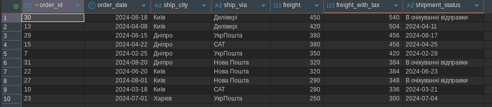

---

## Висновки

**Самооцінка:** 5 (відмінно)

**Обґрунтування:** Виконано в повному обсязі всі завдання трьох рівнів складності (Рівень 1, Рівень 2 та Рівень 3 — загалом 68 SQL-запитів). Усі запити оптимізовані, структуровані відповідно до стандартів чистого коду, протестовані на реальній хмарній базі даних Neon PostgreSQL 18 та проілюстровані знімками екрана виконання у DBeaver. Продемонстровано глибоке володіння синтаксисом DQL, логічними операторами, пошуком за шаблонами, пагінацією та аналітичними виразами CASE/COALESCE.
